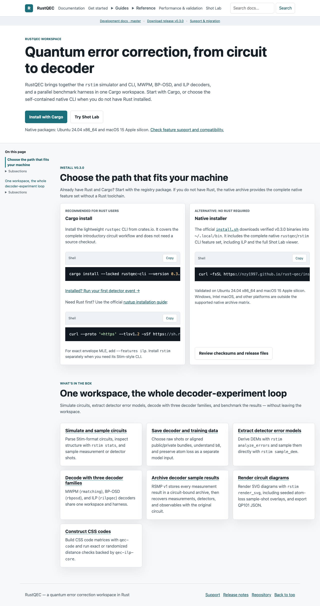
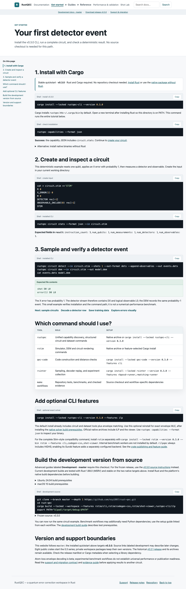
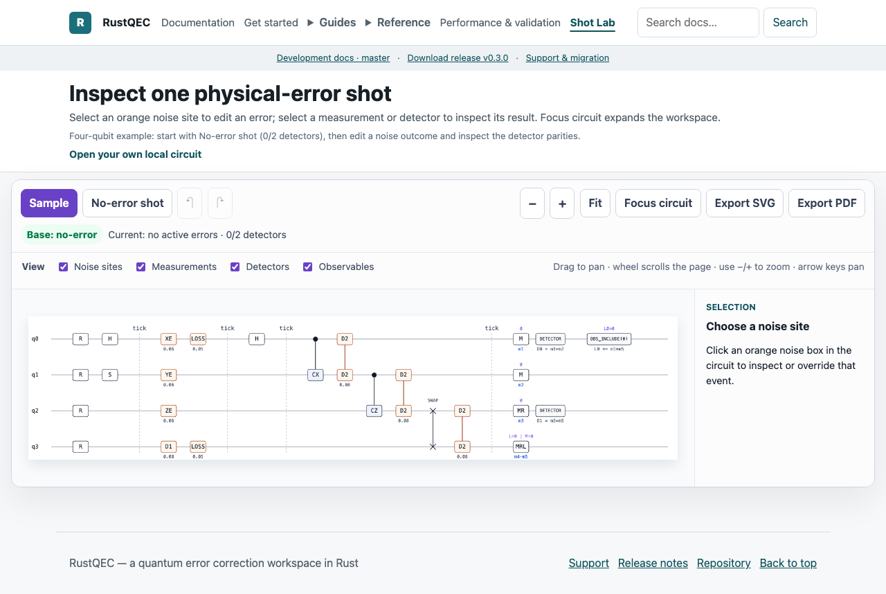

# Documentation usability verification — PR #707

Verified locally on 2026-09-09. These PNGs are intentional review evidence, generated by the browser test `captures the homepage, quickstart, and Shot Lab surfaces for review`. They show the local built site; they are not evidence of deployment to GitHub Pages.

## Completed audit items

| Priority | Problem | Result |
| --- | --- | --- |
| P1 | Homepage and quickstart choose different install paths | Cargo v0.3.0 is the default throughout; native install is an explicit alternative. |
| P1 | Decoding starts with benchmark infrastructure | A standalone, published rmatching v0.3.0 example maps detector rows `11` and `00` to logical predictions `1` and `0`. |
| P1 | Stable install and development commands are mixed | Quickstarts and API links pin v0.3.0; advanced commands identify master and link to separate development prerequisites. |
| P2 | Documentation, command/API references, and data guidance are hard to discover | New documentation index and local full-text search; CLI/API table; explicit Sampling & training data label. |
| P2 | Tutorial pages lead with evidence bookkeeping | Working tasks precede benchmark workflows; provenance and reproduction details are expandable. |
| P2 | Shot Lab consumes the first screen before event inspection | Compact header, desktop inspector beside the circuit, narrow-screen stacked layout, and focus mode. |
| P2 | Long-page navigation omits subsections and current location | Nested TOC, permanent heading links, active location, and measured sticky-header offset. |
| P2 | Commands and results look alike | Language labels, lexical color, unchanged copy text, and separate expected-output treatment. |
| P2 | Result plots require leaving the page and lack reading guidance | Axis captions and scoped takeaways, in-page enlargement/zoom, Escape focus restoration, and original downloads. |

## Verification

- `make build-site` — passed, including generated viewer assets and the local search index.
- `python3 tools/check_site_build.py _site --repo-root .` — 8 checks passed, no warnings; validates links for subpath deployment and checked benchmark provenance.
- `cargo test --locked -p rstim --test site_contract` — 13 passed.
- `python3 -m unittest tools.test_build_docs_search tools.test_docs_examples tools.test_site_app_rendering tools.test_check_site_build -q` — 32 passed.
- `npm --prefix web/shot-viewer run test:e2e` — 72 passed across Chromium and Firefox. Covers search results/empty/error cases, keyboard navigation, nested headings, code copying, output distinction, narrow-screen overflow, support tables, figure zoom/focus, Shot Lab interaction and vector export.
- `npm --prefix web/shot-viewer run test:e2e -- --grep 'chapter destinations'` — 4 passed after strengthening the anchor test to require the whole heading within the viewport at 768px and 1050px.
- `python3 tools/shot_viewer_assets.py` and `git diff --check` — passed.
- The executable decoder test uses the exact downloadable source, confirms both predictions, and rejects malformed `1x` input with no prediction output. A browser test verifies the highlighted source matches that downloadable file.
- Native Safari visual review of the local quickstart and final Shot Lab layout completed. Automated browser coverage is Chromium and Firefox, not Safari.
- All seven version-pinned docs.rs links returned HTTP 200.
- Independent code review found a sticky navigation offset defect; it was fixed and independently rechecked in both automated browsers. Git harm gate passed.

No new numerical performance campaign was run; plot takeaways are scoped to the committed benchmark rows and checked artifacts.

## Review follow-up

- Replace the fixed desktop viewport deduction with the measured diagram top, updating when headers, toolbars, filters, or the viewport change. Keep document coordinates so scrolling does not resize the workspace; narrow layouts retain their stacked inspector.
- Exclude the schema widget's replaceable headings from the page TOC. Its own schema navigation remains available.
- Both new regression tests failed in Chromium and Firefox before the fix. The final 72-test browser suite passes, including delayed schema loading, live schema selection, extra header height, focus transitions, scrolling, viewport resizing, and mobile stacking.
- Re-ran `make build-site`, the 32 Python tests, 13 Rust site contracts, 8 built-site checks, asset verification, and `git diff --check`. Updated the Shot Lab screenshot from the rebuilt Chromium test output.

## Screenshots

### Homepage

### Quickstart

### Shot Lab

